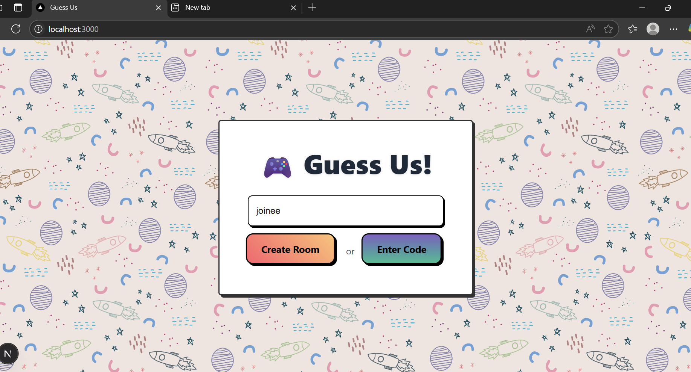
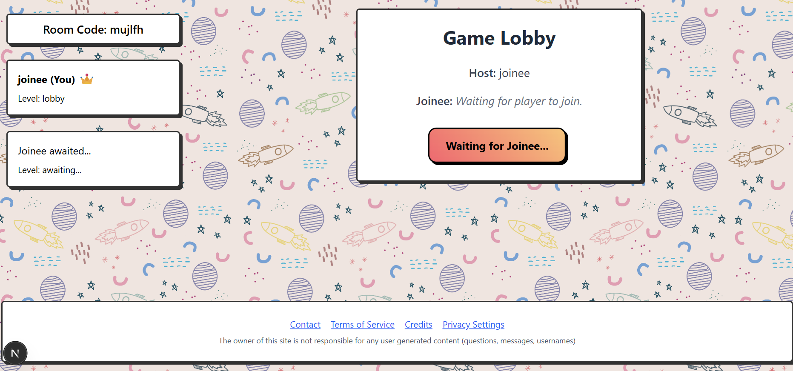
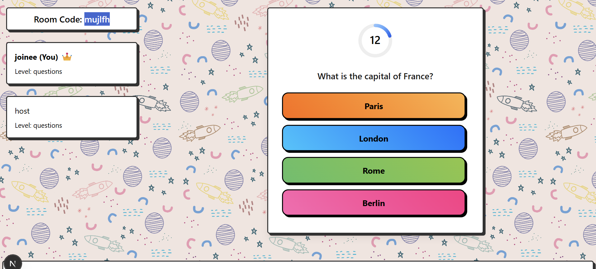
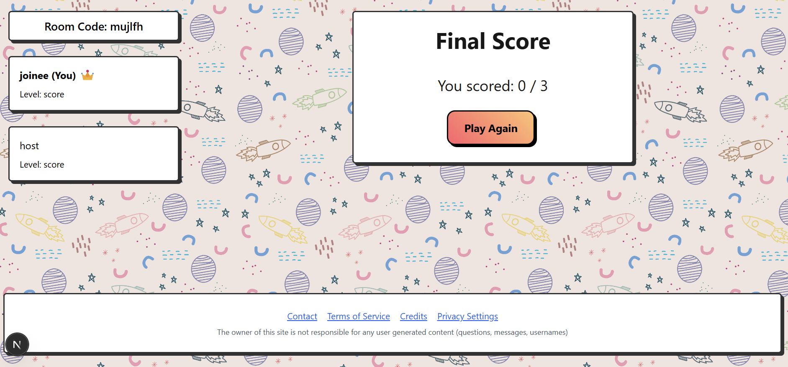

# 🎯 Guess US

> A fast-paced **1v1 real-time quiz game** for couples, friends, and siblings!

---

## 🚀 Features

- 🎮 Real-time 1v1 quiz battles
- ❤️ Designed for couples, friends & siblings
- 💡 Custom categories & random questions
- 🔥 Smooth and interactive gameplay

---

## 📌 Todo

- [ ] Get random questions from a question bank or API
- [ ] Add categories: `Couple`, `Sibling`, `Friend`
- [ ] Improve matchmaking and animations
- [ ] Add support for custom questions

---

## 🛠️ Tech Stack

- **Next.js** + **Firebase** for real-time gameplay
- **Tailwind CSS** for styling
- **Vercel** for deployment

---

## 🤝 Contributing

Pull requests are welcome! If you have ideas for categories or game features, feel free to fork and create a PR.

---

## 📷 Screenshots

  
  

  
  

---

## 🧠 Inspiration

Built to help people bond, compete, and learn about each other — one question at a time.

---

